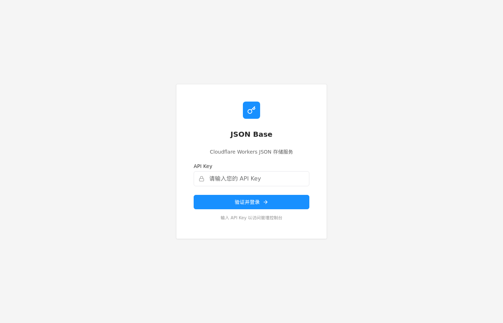
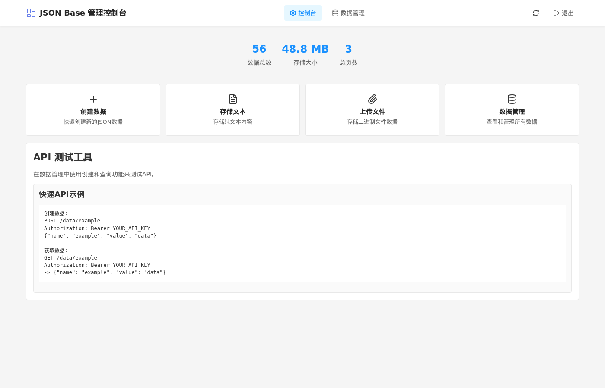
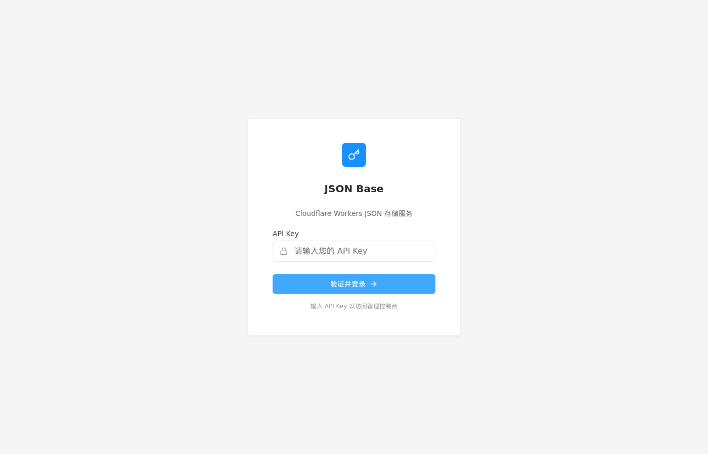

# Rei JSON Base Storage

<div align="center">


**基于 Cloudflare Workers 的 JSON 存储服务**

[](https://workers.cloudflare.com/)
[](https://www.typescriptlang.org/)
[](https://developers.cloudflare.com/d1/)

[English](./README.md) | [中文](./README.zh.md) | [快速开始](#快速开始)

无需服务器管理，快速部署即可使用。

</div>

## 截图预览

<div align="center">

| 登录页面 | 控制台仪表盘 | 数据管理 |
|----------|-------------|----------|
|  |  |  |

</div>

## 快速开始

### 自动化部署

```bash
git clone https://github.com/PBK-B/cloudflare-worker-json-base.git
cd cloudflare-worker-json-base
npm install
npm run auto-deploy
```

### 手动部署

```bash
npm install -g wrangler
wrangler login
npx wrangler d1 create jsonbase
# 修改 d1_databases.database_id 和 vars.API_KEY
vim wrangler.toml
npm run deploy
```

## 使用方法

### 认证

```bash
# Header 认证（推荐）
Authorization: Bearer YOUR_API_KEY

# URL 参数认证
?key=YOUR_API_KEY
```

### 存储数据

```bash
curl -X POST https://your-worker.workers.dev/myapp/config \
  -H "Authorization: Bearer YOUR_API_KEY" \
  -H "Content-Type: application/json" \
  -d '{"theme": "dark"}'
```

响应：`{"status": 1, "message": "storage ok"}`

### 获取数据

```bash
curl -X GET https://your-worker.workers.dev/myapp/config \
  -H "Authorization: Bearer YOUR_API_KEY"
```

### 上传文件

```bash
curl -X PUT https://your-worker.workers.dev/myapp/logo.svg \
  -H "Authorization: Bearer YOUR_API_KEY" \
  --data-binary @/path/to/file.svg
```

### 删除数据

```bash
curl -X DELETE https://your-worker.workers.dev/myapp/config \
  -H "Authorization: Bearer YOUR_API_KEY"
```

## API 端点

| 方法 | 端点 | 说明 |
|------|------|------|
| POST | `/{bucket}/{key}` | 创建/更新数据 |
| GET | `/{bucket}/{key}` | 获取数据 |
| PUT | `/{bucket}/{file}` | 上传文件 |
| DELETE | `/{bucket}/{key}` | 删除数据 |

## WebUI 控制台

访问 `https://your-worker.workers.dev/` 进行可视化管理。

## 配置

在 `wrangler.toml` 中配置：

```toml
name = "your-worker"
main = "dist/index.js"
compatibility_date = "2024-05-02"

[vars]
ENVIRONMENT = "production"
STORAGE_BACKEND = "d1"

[[d1_databases]]
binding = "JSONBASE_DB"
database_name = "jsonbase"
database_id = "xxx"
```

## 常见问题

**API Key 忘记怎么办？**
修改 API_KEY 环境变量重新部署会使用新的 Key。

**数据会丢失吗？**
数据存储在 D1 数据库中，不会丢失。

**支持自定义域名吗？**
支持，在 Cloudflare 后台绑定。

## 贡献者

<a href="https://github.com/PBK-B/cloudflare-worker-json-base/graphs/contributors">
  
</a>

## 感谢

- [jsonbase.com](https://web.archive.org/web/20221007050426/https://jsonbase.com/) - 最初的灵感来源
- [theowenyoung/blog](https://github.com/theowenyoung/blog) - 原始实现参考
- [Cloudflare Workers](https://workers.cloudflare.com/) - 边缘计算平台

## 相关链接

- [开发者文档](./CONTRIBUTING.md)
- [问题反馈](https://github.com/PBK-B/cloudflare-worker-json-base/issues)

---

<div align="center">

**Star 趋势图**

[](https://star-history.com/#PBK-B/cloudflare-worker-json-base&Date)

觉得有用？给个 ⭐ Star 支持一下！

</div>
