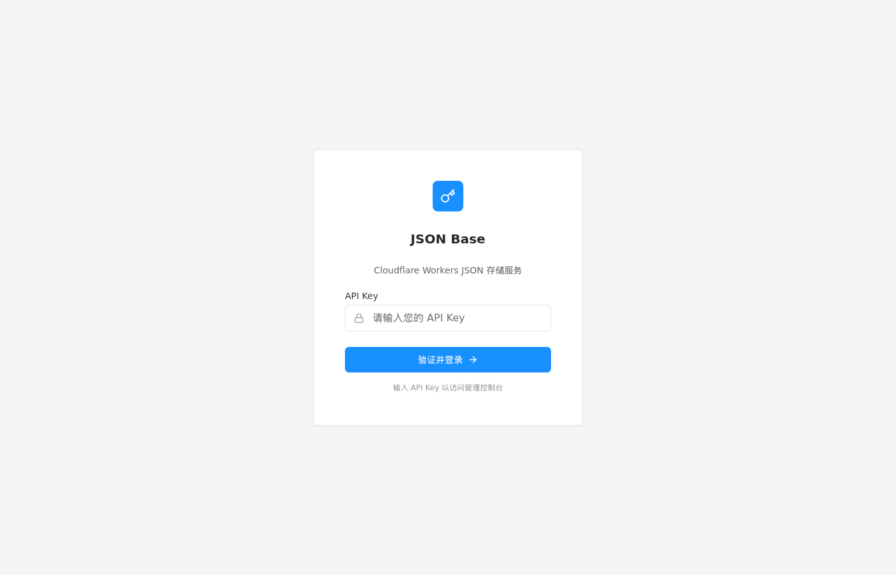
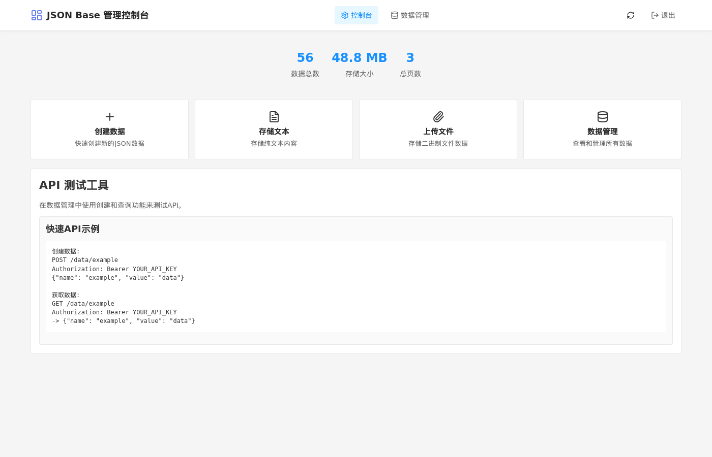
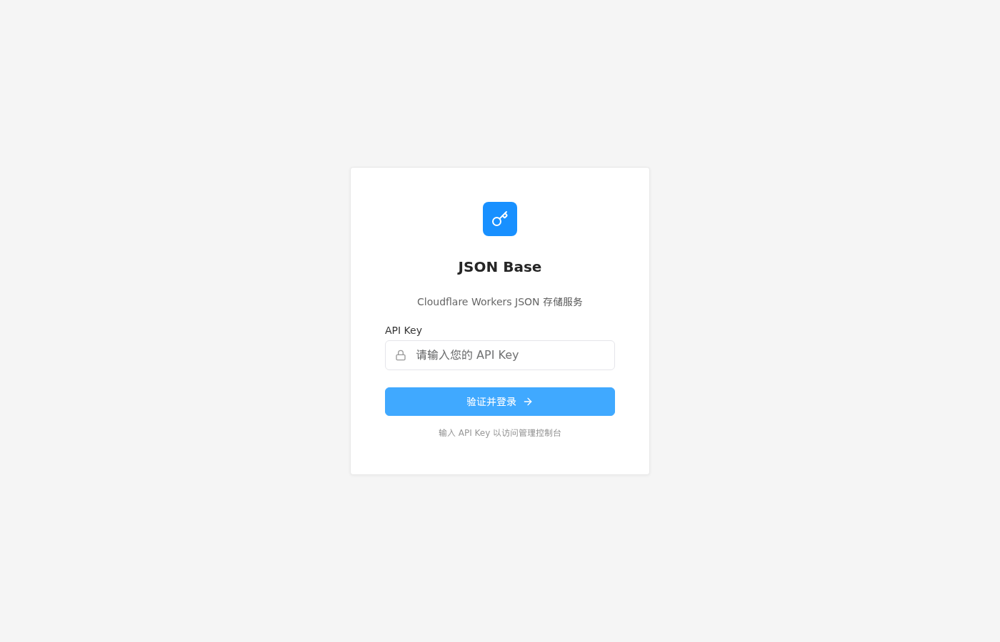

# Rei JSON Base Storage

<div align="center">


**基于 Cloudflare Workers 的 JSON 存储服务**

[](https://workers.cloudflare.com/)
[](https://www.typescriptlang.org/)
[](https://developers.cloudflare.com/d1/)

[English](./README.md) | [中文](./README.zh.md) | [快速开始](#快速开始)

无需服务器管理，快速部署即可使用。

</div>

## 截图预览

<div align="center">

| 登录页面 | 控制台仪表盘 | 数据管理 |
|----------|-------------|----------|
|  |  |  |

</div>

## 快速开始

### 自动化部署

```bash
git clone https://github.com/PBK-B/cloudflare-worker-json-base.git
cd cloudflare-worker-json-base
npm install
npm run auto-deploy
```

### 手动部署

```bash
npm install -g wrangler
npm run deploy
```

现在 `npm run deploy` 会走交互式 `deploy-cli.ts` 流程：

- 询问部署环境、存储后端以及后端资源的选择/创建
- 交互模式下如果 Cloudflare 未登录，会自动执行 `wrangler login`
- `API_KEY` 会写入 Worker Secret，而不是要求手动写进 `wrangler.toml`

常用变体：

```bash
# 校验最终生成配置，但不执行部署
npm run deploy -- --dry-run

# 不交互地打印最终配置
npm run deploy:print -- --env development --storage d1 --d1 jsonbase

# 更新已有部署，但不改动 API_KEY secret
npm run deploy -- --skip-secret
```

常用强制覆盖输入：

- CLI 参数：`--env`、`--storage`、`--d1`、`--kv`、`--api-key`、`--skip-secret`
- 环境变量：`DEPLOY_ENV`、`DEPLOY_STORAGE_BACKEND`、`DEPLOY_D1_DATABASE`、`DEPLOY_KV_NAMESPACE`、`DEPLOY_API_KEY`

## 使用方法

### 认证

```bash
# Header 认证（推荐）
Authorization: Bearer YOUR_API_KEY

# URL 参数认证
?key=YOUR_API_KEY
```

### 存储数据

```bash
curl -X POST https://your-worker.workers.dev/myapp/config \
  -H "Authorization: Bearer YOUR_API_KEY" \
  -H "Content-Type: application/json" \
  -d '{"theme": "dark"}'
```

响应：`{"status": 1, "message": "storage ok"}`

### 获取数据

```bash
curl -X GET https://your-worker.workers.dev/myapp/config \
  -H "Authorization: Bearer YOUR_API_KEY"
```

### 上传文件

```bash
curl -X PUT https://your-worker.workers.dev/myapp/logo.svg \
  -H "Authorization: Bearer YOUR_API_KEY" \
  --data-binary @/path/to/file.svg
```

### 删除数据

```bash
curl -X DELETE https://your-worker.workers.dev/myapp/config \
  -H "Authorization: Bearer YOUR_API_KEY"
```

## API 端点

### 业务资源 API

`/*` 路径用于业务侧直接读写资源。

| 方法 | 端点 | 说明 |
|------|------|------|
| POST | `/{bucket}/{key}` | 创建资源 |
| GET | `/{bucket}/{key}` | 获取资源 |
| PUT | `/{bucket}/{key}` | 完整替换资源 |
| DELETE | `/{bucket}/{key}` | 删除资源 |

这些接口返回资源本体，适合业务系统直接调用。

### 控制台管理 API

`/._jsondb_/api/*` 路径用于 WebUI 和后台管理。

| 方法 | 端点 | 说明 |
|------|------|------|
| GET | `/._jsondb_/api/health` | 校验 API Key 与服务健康状态 |
| GET | `/._jsondb_/api/data` | 控制台资源列表 |
| GET | `/._jsondb_/api/data/{path}` | 获取控制台资源详情 |
| POST | `/._jsondb_/api/data/{path}` | 创建 JSON、文本或文件资源 |
| PUT | `/._jsondb_/api/data/{path}` | 更新 JSON、文本或替换文件资源 |
| DELETE | `/._jsondb_/api/data/{path}` | 删除控制台资源 |
| GET | `/._jsondb_/api/console/*` | 控制台统计、配置和健康状态 |

## WebUI 控制台

访问 `https://your-worker.workers.dev/dash/` 进行可视化管理。

## 配置

在 `wrangler.toml` 中配置默认值：

```toml
name = "your-worker"
main = "dist/index.js"
compatibility_date = "2024-05-02"

[vars]
ENVIRONMENT = "production"
STORAGE_BACKEND = "d1"

[[d1_databases]]
binding = "JSONBASE_DB"
database_name = "jsonbase"
database_id = "xxx"
```

## 常见问题

**API Key 忘记怎么办？**
使用 `--api-key` 或 `DEPLOY_API_KEY` 重新部署即可写入新的 secret；如果只是更新部署且不想改动现有 secret，可使用 `--skip-secret`。

**数据会丢失吗？**
数据存储在 D1 数据库中，不会丢失。

**支持自定义域名吗？**
支持，在 Cloudflare 后台绑定。

## 贡献者

<a href="https://github.com/PBK-B/cloudflare-worker-json-base/graphs/contributors">
  
</a>

## 感谢

- [jsonbase.com](https://web.archive.org/web/20221007050426/https://jsonbase.com/) - 最初的灵感来源
- [theowenyoung/blog](https://github.com/theowenyoung/blog) - 原始实现参考
- [Cloudflare Workers](https://workers.cloudflare.com/) - 边缘计算平台

## 相关链接

- [开发者文档](./CONTRIBUTING.md)
- [问题反馈](https://github.com/PBK-B/cloudflare-worker-json-base/issues)

---

<div align="center">

**Star 趋势图**

[](https://star-history.com/#PBK-B/cloudflare-worker-json-base&Date)

觉得有用？给个 ⭐ Star 支持一下！

</div>
